# A hierarchical mixture modeling framework for population synthesis

Lijun Sun a,∗ , Alexander Erath b , Ming Cai c,∗

a Department of Civil Engineering and Applied Mechanics, McGill University, Montreal, Quebec H3A 0C3, Canada

b Future Cities Laboratory, Singapore-ETH Centre, Singapore 138602, Singapore

c School of Intelligent Systems Engineering, Sun Yat-sen University, Shenzhen, Guangdong 518107, China

## a r t i c l e i n f o

Article history:   
Received 22 September 2017   
Revised 3 June 2018   
Accepted 4 June 2018   
Available online 14 June 2018

Keywords:   
Population synthesis   
Multilevel latent class   
Mixture model   
Probabilistic tensor factorization

## a b s t r a c t

Synthetic population is a key input to agent-based urban/transportation microsimulation models. The objective of population synthesis is to reproduce the underlying statistical properties of real population based on available microsamples and marginal distributions. However, characterizing the joint associations among a large set of attributes is challenging because of the curse of dimensionality, in particular when attributes are organized in a hierarchical household-individual structure. In this paper, we use a hierarchical mixture model to characterize the joint distribution of both household and individual attributes. Based on this model, we propose a framework of generating representative household structures in population synthesis. The framework integrates three models: (1) probabilistic tensor factorization, (2) multilevel latent class model, and (3) rejection sampling. With this framework, one can generalize not only the associations of within- and cross-level attributes, but also reproduce structural relationships among household members (e.g., husband-wife). As a case study, we implement this framework based on the household interview travel survey (HITS) data of Singapore, and then use the inferred model to generate a synthetic population pool. This model demonstrates great potential in reproducing the underlying statistical distribution of real population. The generated synthetic population can serve as a replacement for census in developing agent-based models, with privacy and confidentiality being protected and preserved.

© 2018 Elsevier Ltd. All rights reserved.

## 1. Introduction

Agent-based microsimulation models have become increasingly important in urban/transportation planning practices (e.g., MATSim Balmer et al., 2006). Compared with traditional aggregated planning models, agent-based models simulate the decisions and activities of each individual person over time, providing more detailed and accurate information for planning and policy evaluation. A first and critical step in developing such models is to prepare a list of population (agents) with comprehensive demographic and socioeconomic attributes that may affect agents’ decision-making and activity patterns. An ideal data source for this purpose is the census data of a city, since it registers full information of the whole population. However, due to privacy concerns, the full census data is strictly confidential and even the use of samples and marginals is highly sensitive. To reduce the risk of disclosure, a typical practice of statistical bureaus is to release two sets of reproduced data separately: (D1) a small fraction (e.g., 1–5%) of disaggregated microsamples, and (D2) marginal distributions for different attributes. Data set (D1) is often referred to as the public use micro samples (PUMS). Data set (D2) is usually provided as one-way, two-way, and sometimes multi-way cross-tabulations aggregated from the full census.

Because of the confidentiality and privacy issues in using census, developing methodologies to generate a synthetic population has received considerable attention in the literature. A common objective of these models is to take full use of the available microsamples and marginals to create a representative list of agents, which can reproduce the underlying structure and statistical properties of the real population as much as possible. In practice, it is not easy to achieve this goal and there are three challenging problems to be addressed in designing population synthesis models. The first challenge is to preserve the high-dimensional dependency structure and match the aggregated data without introducing potential biases. For example, at the individual level, age and income are clearly associated, while intuitively we may consider age and sex to be independent across the population. At the household level, a good example is the dependency between dwelling type and number of household members—a household with more members needs a large house. These association structures become more and more complex when the number of attributes gets larger, and an ideal population synthesis model should be able to fully capture these structures. Most existing works on population synthesis have focused on solving this problem. The second challenge is to associate both household-level attributes and individual-level attributes in a unified manner (Anderson et al., 2014). For example, car availability (as a household attribute) should be strongly related to whether household members have driving licenses (as an individual attribute). The third challenge is to reproduce the interdependencies among agents in the same household (e.g., the relationship of husband and wife), even this type of structural relationship is not reported in the census data. While the latter two issues are as critical as the first one, in the past little attention is paid to reproduce the cross-level and within-household associations.

There is a vast literature on population synthesis modeling. In general, previous work can be split into three categories: (1) synthetic reconstruction (SR) (e.g. Deming and Stephan, 1940; Beckman et al., 1996), (2) combinatorial optimization (CO) (e.g. Williamson et al., 1998; Voas and Williamson, 2001), and (3) statistical learning (SL) (e.g. Farooq et al., 2013; Sun and Erath, 2015; Saadi et al., 2016; Hu et al., 2017). In terms of development, SR and CO-based models have been studied for decades and applied in various projects. However, these models often have some problems in implementation and a critical one is that SR and CO only replicate existing agents in the PUMS. Thanks to the advances in statistical learning theory and application, probabilistic and SL-based models have become emerging in the development of population synthesis models recently. In comparison with SR and CO, SL-based approaches try to encode the structure of population as a probabilistic model, and thus it is able to generate “real” synthetic data by sampling from the distribution instead of cloning (Farooq et al., 2013). Among those SL-based approaches, notably, Hu et al. (2017) proposed to model household-individual association using a nested latent class structure. This seems to be the first SL-based work addressing the association issues among household-individual attributes. The Dirichilet process is used to capture the number of latent classes in a nonparametric Bayesian setting. This model shows great potential in capturing the interdependencies among individuals within the same household by using a household class-specific conditional distribution. Although this model is both flexible and effective, the underlying assumptions still create some problems in real-world implementations. First of all, given the conditional independence assumption for individuals in the same household, it cannot fully characterize structural relationships in households. Second, since individual classes are defined separately for each group-level class, the model needs a large number of parameters and the computational cost in Bayesian inference could be high when the size of input data and the number of attributes of interest become large.

In this paper, we use a hierarchical probabilistic model to capture and reproduce the structure of population at both household and individual levels. To better characterize the underlying joint distribution for both households/individuals and the within-/cross-level association structures, the proposed framework integrates three models: (1) probabilistic tensor factorization (Sun and Axhausen, 2016), which is applied to model the joint distribution for nominal categorical variables at each level using a mixture structure, (2) multilevel latent class model (Vermunt, 2003; 2008), which captures the interaction between household-level and individual-level latent classes, and (3) rejection sampling, which further filters the synthetic population to preserve the structural relationships among individuals in the same household (e.g., husbandwife-child). The first two models provides an integrated probabilistic model for full household observations. Based on the estimated model, we can generate a large pool of synthetic population from the inferred model. The first two models ensures this hierarchial mixture framework to capture the association among household- and individual-level attributes; however, it still cannot reproduce meaningful individual associations within a household due to the assumption that individuals are independent given household class label. To correct this, rejection sampling (the third model) is used as a postprocessing step, in which we transform the structural relationships into a target distribution to filter those created households/individuals. The remaining samples after rejection sampling are used as the final synthetic population. This integrated framework allows us to learn the underlying structure distribution of population from limited PUMS data. In applying this model, one only need the PUMS data as input and define two hyperparameters (G and M for numbers of latent classes at the household level and the individual level, respectively). The MATLAB codes for this project are available at https://github.com/lijunsun/population_synthesis_hierarchical.

The remainder of this paper is organized as follows. In Section 2, we review previous literature on population synthesis modeling. Section 3 first provides an overview of the hierarchical population synthesis problem, and then presents a model that integrates probabilistic tensor factorization and multilevel latent class model. In addition, an efficient expectation maximization (EM) algorithm is derived for model inference. Using the household interview travel survey (HITS) data in

Singapore, we illustrate the application of the proposed framework in Section 4. We also show the use of rejection sampling as a postprocessing step to capture complex interdependencies among household members. Finally, Section 5 concludes the study and suggests future research directions.

## 2. Literature review

In principle, the generation of a synthetic population involves two steps. The first step is to develop a model to learn the joint distribution of all attributes of interest from the PUMS and available marginals. This step is often referred to as “fitting”. The second step—“generation”—is to create a new set of synthetic data by drawing from the fitted distribution.

A critical research question in population synthesis is to make the fitted distribution as realistic and representative as possible. Previous efforts in addressing the fitting problem have been focused on SR and CO approaches. These two approaches have been developed for decades and widely applied in urban/transportation planning projects. However, as mentioned, a major limitation of these two approaches is that they only replicate existing agents in the PUMS rather than obtain a random draw from the underlying distribution. Taking the iterative proportional fitting (IPF) algorithm—the backbone of SR—as an example, if a particular agent (combination of attributes) is not observed in the PUMS, it will not be created in the synthetic data because the initial cell corresponding to the combination is zero. A common practice to deal with this zero-cell problem is to add a small value to initialize those zero cells. However, by doing so one will introduce an arbitrary bias in the underlying correlation structure (Guo and Bhat, 2007). This problem becomes even more difficult in the situation where we only have a small set of PUMS but many attributes to consider, because most cells in the high-dimensional contingency table will be zero. Besides the SR and CO approaches, Barthelemy and Toint (2013) developed a sample-free method that requires only marginals as input. As a particular type of SR, this method is able to produce synthetic population when disaggregated samples are not available. We refer readers to Müller and Axhausen (2011), Farooq et al. (2013), and Sun and Erath (2015) for a brief review about SR/CO-based models. Below we mainly review the SL track and its extensions on joint synthesis for both household and individual attributes.

Recent advances in statistical learning has provided us with alternative data-driven tools and methods to solve the population synthesis problem, in particular on characterizing the complex interactions and the generation of multivariate population data (see e.g., Caiola and Reiter, 2010; Farooq et al., 2013; Sun and Erath, 2015; Saadi et al., 2016; Hu et al., 2017). We refer to this track as statistical learning (SL)-based models. Compared with SR and CO, SL considers each microsample an observation from the underlying joint distribution of all attributes and the goal is to find the best model configuration to characterize this distribution explicitly. In other words, SL focuses on the joint distribution directly instead of replicating existing samples. By doing so, a probability can be estimated for each combination, including those combinations which are not observed in the PUMS. In building such models, one often first proposes a parametric model and then learn its structure and parameters by maximizing likelihood using the observed microsamples and marginals. These models in general offer good performance in dealing with the lack of heterogeneity problem in SR and CO. Below we summarize some signature contributions on this track. In order to reduce to risk of disclosure, Reiter (2005) employed classification and regression tree (CART) as an imputation method to replace sensitive attributes with multiple imputations. Caiola and Reiter (2010) further developed this model by replacing CART with random forest (RF). Given the high dimensionality of the population synthesis problem, it is typically very difficult to model the joint distribution directly. Farooq et al. (2013) used Markov chain Monte Carlo (MCMC) to draw samples by performing Gibbs sampling to update attributes in sequence based on conditional distributions. If the total number of attributes is n, preparing the full conditional distributions is equivalent to modeling n subproblems with each having n − 1 attributes. Although the problem becomes easier than the original one by reducing one dimension, it is still very challenging when n is large. The authors proposed several methods to build those conditionals, such as summarizing the microsamples into marginal conditionals, estimating parametric models (e.g., discrete choice), and use partial conditionals instead of full conditionals with the risk of introducing potential bias. Similarly, Saadi et al. (2016) used hidden Markov model (HMM) to capture the correlation and complex dependencies among a set of attributes by positioning them in a certain sequence. In this model, the closer two attributes are, the more the correlation/association can be captured between them. Overall, these models focus on the synthesis of individuals (or assigning household attributes to individuals), while little attention is paid to the hierarchical household structure due to the difficulty in encoding both household and individual attributes jointly. Sun and Erath (2015) is special case extending the generation of individuals to full household. However, as a first step it requires one to define individual types (i.e., household owner, spouse of household owner, and others) and household structures manually (i.e., owner only, owner-others, owner-spouseothers), and thus many models need to be estimated for each type/structure. In additional, since individuals are generated in a owner-spouse-other hierarchy, the associations of individual attributes for spouses and others may not be preserved as much as those for owners even using a complex network structure.

In the SR and CO frameworks, the modeling of within- and cross-level associations among household- and individuallevel attributes is usually done by first sampling a household and then gathering individuals to fill it (Ye et al., 2009; Pritchard and Miller, 2012; Barthelemy and Toint, 2013; Zhu and Ferreira, 2014). In SL-based approaches, this type of associations are modeled in different ways. Sun and Erath (2015) proposed to use Bayesian network to model the interdependencies among both household and individual attributes. This Bayesian network model can efficiently encode the joint distribution using a probabilistic graphical structure, and the sampling of full household can be performed in a hierarchial manner. This model is particularly useful in the case where the sample size is limited in the PUMS while the number of attributes is large. Casati et al. (2015) further developed the MCMC model of Farooq et al. (2013) to account for the hierarchical structure of households and individuals. Hu et al. (2017) developed a non-parametric Bayesian mixture model to characterize the joint distribution of household and individual attributes in a nested framework. This model shows great performance in characterizing the underlying distribution of the hierarchical household/individual variables. To some extent, the multilevel latent class structure can even capture the association between different individuals in the same household. However, as mentioned, strong interdependencies such as husband and wife may not be well captured by drawing individuals independently. On the other hand, by allowing individual-level classes to vary across household-level classes, the model can be difficult to estimate, also prone to the risk of overfitting. Based on this work, in the next section we introduce a product multinomial hierarchical mixture structure for population synthesis. To use information more efficiently, the proposed model borrows information at the individual-level by restricting individual-level classes to be universal and shared across all household-level classes.

Table 1  
Sample of household survey data.
<table><tr><td>HID</td><td>Dwell</td><td>Eth</td><td>Car</td><td>Npax</td><td>IID</td><td>Age</td><td>Sex</td><td>Income</td><td>License</td><td>Pass</td></tr><tr><td>1</td><td>Condo</td><td>Indian</td><td>Yes</td><td>3</td><td>1</td><td>45-49 yrs old</td><td>M</td><td>$5000-5999</td><td>Yes</td><td>PR</td></tr><tr><td></td><td></td><td></td><td></td><td></td><td>2</td><td>35-39 yrs old</td><td>F</td><td>$2000-2499</td><td>No</td><td>PR</td></tr><tr><td></td><td></td><td></td><td></td><td></td><td>3</td><td>10-14 yrs old</td><td>M</td><td>No income</td><td>No</td><td>PR</td></tr><tr><td>2</td><td>HDB 3</td><td>Malaysia</td><td>No</td><td>2</td><td>1</td><td>55-59 yrs old</td><td>F</td><td>$3000-3999</td><td>No</td><td>Citizen</td></tr><tr><td></td><td></td><td></td><td></td><td></td><td>2</td><td>10-14 yrs old</td><td>F</td><td>No income</td><td>No</td><td>Citizen</td></tr><tr><td>3</td><td>Landed</td><td>Chinese</td><td>Yes</td><td>4</td><td>1</td><td>45-49 yrs old</td><td>M</td><td>$6000-7999</td><td>Yes</td><td>Citizen</td></tr><tr><td></td><td></td><td></td><td></td><td></td><td>2</td><td>40-44 yrs old</td><td>F</td><td>No income</td><td>No</td><td>PR</td></tr><tr><td></td><td></td><td></td><td></td><td></td><td>3</td><td>20-24 yrs old</td><td>M</td><td>$3000-3999</td><td>Yes</td><td>Citizen</td></tr><tr><td></td><td></td><td></td><td></td><td></td><td>4</td><td>10-14 yrs old</td><td>F</td><td>No income</td><td>No</td><td>Citizen</td></tr><tr><td>i</td><td>x</td><td>X</td><td>x</td><td>x(ni)</td><td>1</td><td>5152</td><td>16</td><td></td><td></td><td></td></tr><tr><td></td><td></td><td></td><td></td><td></td><td>2</td><td></td><td></td><td>Xx</td><td>88</td><td></td></tr><tr><td></td><td></td><td></td><td></td><td></td><td>：</td><td></td><td>…</td><td>…</td><td>…</td><td></td></tr></table>

HID and IID represent household ID and individual ID, respectively. Npax denotes the total number of individuals within a household. The household-level attributes are Dwell — dwelling type, Eth — ethnicity, Car — car availability, and Npax — the total number of people in the household. The individual-level attributes are Age, Sex, Income, License — whether the individual has a driving license, and Pass — pass type of status (citizen/permanent resident).

## 3. Modeling framework

In this section we present the population synthesis framework with a product multinomial hierarchical mixture model. The framework models a household using a hierarchical (two-level) data structure. The first level consists of all householdlevel attributes which are shared among all household members. Examples of such attributes include dwelling type, car availability, and the total number of household members. At the second level, we focus on each individual person and his/her demographic/socioeconomic attributes (e.g., age, sex, and income). In this case, we assume that all attributes are coded as categorical variables. We begin with describing this hierarchical structure using the example of the household interview travel survey (HITS) in Singapore.

## 3.1. Problem description

One essential input to this problem is the PUMS. However, when the PUMS is not available, as a replacement one can use large scale surveys registering both household and individual information (e.g., HITS). Table 1 shows an example structure of Singapore’s HITS.

Following the example in Table 1, we model both household- and individual-level attributes as nominal categorical variables. The following notations are used in this paper. We use $i = 1 , \ldots , N$ to index households in the PUMS. Let $\mathbf { x } _ { i }$ denote the full information of household i. In an observation, we use $k = 1 , \ldots , h$ to index household-level attributes: dwelling type, ethnicity, car availability, and the total number of people. For each attribute $k = 1 , \ldots , h ,$ we define $x _ { i } ^ { k } \in \{ 1 , \ldots , d _ { k } \}$ as a discrete value starting from one, where $d _ { k }$ is the total number of categories for attribute k. For example, $d _ { k } = 2 \ ( \mathrm { Y e s }$ , No) for the attribute car availability. We denote by $n _ { i }$ the total number of people in household i. In the proposed model, $n _ { i }$ is also considered a household-level attribute $( x _ { i } ^ { 4 } )$ . At the individual level, we use $k = h + 1 , \ldots , K$ to index attributes age, sex, income, driving license, and pass type. We use $\mathbf { \dot { x } } _ { i j } = ( x _ { i j } ^ { h + 1 } , \dots , x _ { i j } ^ { K } ) ^ { \top }$ to denote the full observation of individual j in household i. Same as household-level attributes, individual-level attributes are also considered categorical variables and each $x _ { i j } ^ { k }$ is modeled as a discrete values starting from one $( x _ { i i } ^ { k } \in \{ 1 , \ldots , d _ { k } \} , \ k = h + 1 , \ldots , K )$ . In the example of Table 1, we have 9 attributes in total $\left( K = 9 \right)$ , of which 4 are at the household level $( h = 4 )$ and 5 are at the individual level.

## 3.2. Product multinomial hierarchical mixture model

In a probabilistic setting, our goal is to find the best configuration of $p ( \mathbf { x } _ { i } )$ that can encode the joint distribution of household-level attributes and individuals within the household efficiently and effectively. However, since $\mathbf { x } _ { i }$ is coded in a hierarchical structure, it is difficult for us to write down a closed-form solution directly.

A simple solution is to remove the hierarchical structure by assigning household-level attributes to each individual (i.e., $\mathbf { x } _ { i } = \left( x _ { i } ^ { 1 } , \ldots , x _ { i } ^ { K } \right) ^ { \top } )$ . By doing so we essentially ignore the hierarchial feature and a potential approach to model the joint distribution of high-dimensional categorical variables is the probabilistic tensor factorization method (Dunson and Xing, 2012; Sun and Axhausen, 2016). We assume that all attributes are at the individual level and encode the joint distribution using a probabilistic CANDECOMP/PARAFAC (CP) factorization (i.e., product multinomial mixture) model with M latent classes.

$$
p \big ( \mathbf { x } _ { i } | \pi , \pmb \theta \big ) = \sum _ { m = 1 } ^ { M } \pi _ { m } \Bigg [ \prod _ { k = 1 } ^ { K } \theta _ { x _ { i } ^ { k } m } ^ { ( k ) } \Bigg ] ,\tag{1}
$$

where $\pi _ { m }$ denotes the probability that an observation belongs to class m. $\theta _ { c _ { k } m } ^ { ( k ) } = p _ { m } \big ( x _ { i } ^ { k } = c _ { k } \big )$ is the probability of observing $x _ { i } ^ { k } = c ^ { k }$ if an observation $\mathbf { x } _ { i }$ belongs to class m.

The underlying assumption is that the joint distribution of all categorical variables can be expressed as a mixture of latent components, with each being a product multinomial. By doing so, the probabilistic tensor factorization model transforms the original data using low-dimensional latent factors, allowing us to model the data with an efficient representation. However, by flattening the hierarchical structure, one essentially ignores the interdependencies among household members. On the other hand, household attributes and individual attributes in general have their own latent structures, therefore removing the hierarchical structure further increases the dimensionality of the data and the model may require far more mixture components to fully capture the joint associations.

To better account for the hierarchical structure in our model, we propose to integrate the multilevel latent class model on the product multinomial mixture model. Multilevel latent class model is first introduced by Vermunt (2003, 2008). It is an extension of the classical latent class model (or finite mixture model) for hierarchical data sets. The model assumes that there are latent classes at both group (household in our case) and individual levels, and the interaction between the two levels can be captured using a conditional distribution on the latent class labels. Below we describe the integrated product multinomial hierarchical mixture model without universal classes at the individual level. Before presenting the formulation, we introduce the following assumptions and notations in the setting of population synthesis:

• there exist G latent classes at the household level. We use $g = 1 , \ldots , G$ to index these classes.

• for each household-level latent class $g = 1 , \ldots , G ,$ there exist M latent classes at the individual level $( m = 1 , \ldots , M )$ . Note that individual-level latent classes are defined separately for each household-level latent class g.

• each household i belongs to a certain group-level latent class g (the membership is labeled as $z _ { i } )$ . We denote $\lambda _ { g } =$ $p ( z _ { i } = g )$ as the probability that a household i belongs to household-level class g.

• given $z _ { i } = g ,$ household-level attributes are conditionally independent and the joint distribution can be expressed as a product multinomial. In other words, we have $\begin{array} { r } { p ( x _ { i } ^ { 1 } , \ldots , x _ { i } ^ { h } | \bar { z _ { i } } = g ) = \prod _ { k = 1 } ^ { h } \phi _ { x _ { i } ^ { k } g } ^ { ( k ) } } \end{array}$ . For any household-level attribute $k =$ $1 , \ldots , h$ , we denote $\phi _ { c _ { k } g } ^ { ( k ) } = p ( x _ { i } ^ { k } = c _ { k } | z _ { i } = g ) \ ( \forall c _ { k } = 1 , \ldots , d _ { k } , \ \forall g = 1 , \ldots , G ) .$

• within a household i with label $z _ { i } = g ,$ each individual $j \ ( j = 1 , \ldots , n _ { i } )$ belongs to a certain individual-level latent class m (the membership is labeled as $z _ { i j } ) .$ . We denote $\mu _ { g m } = p ( z _ { i j } = m | z _ { i } = g )$ as the conditional probability that an individual j—in household i—belongs to class m given the household membership $z _ { i } = g .$

• individual-level attributes are conditionally independent given $z _ { i } = g$ and $z _ { i j } = m$ , and the joint distribution of ${ \bf { x } } _ { i j } =$ $( x _ { i j } ^ { h + 1 } , \hdots , x _ { i j } ^ { K } )$ is also a product multinomial. In other words, we have $\begin{array} { r } { p ( x _ { i j } ^ { h + 1 } , \ldots , x _ { i j } ^ { K } | z _ { i } = g , z _ { i j } = m ) = \prod _ { k = h + 1 } ^ { K } \theta _ { x _ { i j } ^ { k } g m } ^ { ( k ) } } \end{array}$ . For

any individual-level attribute $k = h + 1 , \ldots , K ,$ , we denote $\theta _ { c _ { k } g m } ^ { ( k ) } = p ( x _ { i j } ^ { k } = c _ { k } | z _ { i } = g , z _ { i j } = m ) \ ( \forall c _ { k } = 1 , \ldots , d _ { k } , \ \forall g = 1 , \ldots , G ,$ $\forall m = 1 , \ldots , M )$

For simplicity, let $\lambda = \{ \lambda _ { g } : g = 1 , \ldots , G \}$ , let $\pmb { \mu } = \{ \mu _ { g m } : g = 1 , . . . , G , m = 1 , . . . , M \}$ , let $\pmb { \phi } = \{ \phi _ { c _ { k } g } ^ { k } : k = 1 , \ldots , h , c _ { k } =$ $1 , \ldots , d _ { k } , \ g = 1 , \ldots , G \}$ , and let $\pmb \theta = \{ \theta _ { c _ { k } , g m } ^ { ( k ) } : k = h + 1 , \ldots , K , \enspace c _ { k } = 1 , \enspace \mathrm { , ~ } \ldots , d _ { k } , \enspace g = 1 , \enspace \mathrm { , ~ } \ldots , G , \enspace m = 1 , \enspace \mathrm { , ~ } \ldots , M \}$ . Based on the asksumptions above, we can derive the probability of observing a full household $p ( \mathbf { x } _ { i } )$ . Firstly, by integrating out $z _ { i j }$ in $p ( \mathbf { x } _ { i j } | z _ { i } = g , z _ { i j } = m )$ , the probability of observing individual j in a household i conditional on $z _ { i } = g$ can be written as a mixture of product multinomials

$$
p \big ( \mathbf { x } _ { i j } | z _ { i } = g \big ) = \sum _ { m = 1 } ^ { M } \mu _ { g m } \left[ \prod _ { k = h + 1 } ^ { K } \theta _ { x _ { i j } ^ { k } g m } ^ { ( k ) } \right] .\tag{2}
$$

Taking household information into account, the probability of observing full information $\mathbf { x } _ { i }$ is given by

$$
\begin{array} { r l } & { p \big ( \mathbf { x } _ { i } ; \lambda , \mu , \boldsymbol { \phi } , \boldsymbol { \theta } \big ) = \displaystyle \sum _ { g = 1 } ^ { G } \lambda _ { g } \Biggl [ \prod _ { k = 1 } ^ { h } \phi _ { x _ { i } ^ { k } g } ^ { ( k ) } \prod _ { j = 1 } ^ { n _ { i } } p \big ( \mathbf { x } _ { i j } | z _ { i } = g \big ) \Biggr ] } \\ & { \quad \quad \quad = \displaystyle \sum _ { g = 1 } ^ { G } \lambda _ { g } \Biggl [ \prod _ { k = 1 } ^ { h } \phi _ { x _ { i } ^ { k } g } ^ { ( k ) } \prod _ { j = 1 } ^ { n _ { i } } \left[ \sum _ { m = 1 } ^ { M } \mu _ { g m } \left[ \prod _ { k = h + 1 } ^ { K } \theta _ { x _ { i } ^ { k } g m } ^ { ( k ) } \right] \right] \Biggr ] , } \end{array}\tag{3}
$$

where λ, μ, φ and θ are parameters to be estimated. As individual-level class label $z _ { i j }$ is conditional on household-level class $z _ { i } ,$ the model is able to reproduce the interdependencies among individuals within the same household.

The proposed hierarchical structure simplifies the modeling of original data using low-dimensional latent factors at each level, thus providing us a compact representation of the hierarchical data structure. As a result, it substantially reduces the number of parameters in modeling $\mathbf { x } _ { i } ,$ and hence the model can efficiently estimate the probability of observing a household in Eq. (3). With this formulation, the likelihood of observing all input data (e.g., PUMS, or the survey in Table 1) can be written as:

$$
\mathcal { L } \big ( \lambda , \mu , \phi , \pmb \theta | \mathbf { x } \big ) = \prod _ { i = 1 } ^ { N } p \big ( \kappa _ { i } ; \lambda , \mu , \phi , \pmb \theta \big ) ,\tag{4}
$$

where N is the total number of households in the survey data.

## 3.3. Model inference

A common approach to estimate parameters in latent class models is to apply the expectation maximization (EM) algorithm. The EM algorithm is an efficient tool for mixture distribution problems and missing data problems (Dempster et al., 1977). In mixture models, the EM algorithm treats class labels as unobserved latent variables and performs an iterative updating method to estimate parameters. The algorithm involves two steps in each iteration. The expectation (E) step formulates the expectation of the complete log-likelihood function, and computes the expected value of latent variables given current estimates of the parameters. Under current expected values of those latent variables, the maximization (M) step estimates parameters by maximizing the expected complete log-likelihood function. In implementation, the EM algorithm starts with random initializations for all parameters and then perform the E-M procedure iteratively until it reaches convergence.

Sun and Axhausen (2016) introduced an EM-based algorithm to infer product multinomial mixture models used to model high-dimensional categorical transportation data. In principle, this algorithm provides solution to a special case of the proposed hierarchial mixture problem when there is only one level. In our case where each level is characterized by a product multinomial, we can integrate the decomposition in Sun and Axhausen (2016) to the EM solution provided by Vermunt (2008), which presented an adapted EM algorithm for a general multilevel latent class model. By treating the class membership variables z (both $z _ { i }$ and $z _ { i j } )$ as missing values, we can write down the joint distribution of x and z. In doing so, we first derive the complete likelihood function for a sample $\mathbf { x } _ { i }$ following Eq. (3):

$$
p \left( \mathbf { x } _ { i } , z _ { i } , \mathbf { z } _ { i } ; \lambda , \mu , \boldsymbol { \phi } , \boldsymbol { \theta } \right) = \prod _ { g = 1 } ^ { G } \left[ \lambda _ { g } \prod _ { k = 1 } ^ { h } \phi _ { x _ { i } ^ { k } g } ^ { ( k ) } \prod _ { j = 1 } ^ { n _ { i } } \left[ \prod _ { m = 1 } ^ { M } \left[ \mu _ { g m } \prod _ { k = h + 1 } ^ { K } \theta _ { x _ { i } ^ { k } g m } ^ { ( k ) } \right] ^ { \mathbb { I } \left( z _ { i j } - m \right) } \right] \right] ^ { \mathbb { I } \left( z _ { i } - g \right) } ,\tag{5}
$$

where $\mathbf { z } _ { i }$ · represents the collection of $z _ { i j }$ for all individuals, and I(e) is an indicator function which equals to 1 if e is true and 0 otherwise.

With this formulation, the complete log-likelihood function can be decomposed into a sum of local terms:

$$
\log \mathcal { L } \left( \lambda , \mu , \phi , \theta | \mathbf { x } , \mathbf { z } \right) = \sum _ { i = 1 } ^ { N } \sum _ { g = 1 } ^ { G } \mathbb { I } ( z _ { i } = g ) \left[ \log \lambda _ { g } + \sum _ { k = 1 } ^ { h } \log \phi _ { x _ { i } g } ^ { ( k ) } + \sum _ { j = 1 } ^ { n _ { i } } \sum _ { m = 1 } ^ { M } \mathbb { I } \left( z _ { i j } = m \right) \left[ \log \mu _ { g m } + \sum _ { k = h + 1 } ^ { K } \log \theta _ { x _ { i } g m } ^ { ( k ) } \right] \right] .\tag{6}
$$

Taken together, the expectation of complete data log-likelihood function with respect to the latent variable z becomes

$$
\begin{array} { r l } & { \mathbb { E } _ { \mathbf { z } | \mathbf { x } , \lambda , \mu , \phi , \theta } \Big [ \log \mathcal { L } \big ( \lambda , \mu , \boldsymbol { \phi } , \theta \big ) \Big ] = \displaystyle \sum _ { i = 1 } ^ { N } \sum _ { g = 1 } ^ { G } \gamma _ { i } ^ { g } \Bigg [ \log \lambda _ { g } + \sum _ { k = 1 } ^ { h } \log \phi _ { x _ { i } ^ { k } g } ^ { ( k ) } \Bigg ] } \\ & { \qquad + \displaystyle \sum _ { i = 1 } ^ { N } \sum _ { g = 1 } ^ { G } \sum _ { j = 1 } ^ { n _ { i } } \sum _ { m = 1 } ^ { M } \gamma _ { i } ^ { g } \rho _ { i j } ^ { g m } \Bigg [ \log \mu _ { g m } + \sum _ { k = h + 1 } ^ { K } \log \theta _ { x _ { i } ^ { k } g m } ^ { ( k ) } \Bigg ] . } \end{array}\tag{7}
$$

where $\gamma _ { i } ^ { g } = \mathbb { E } _ { \mathbf { z } | \mathbf { x } , \lambda , \mu , \phi , \theta } [ \mathbb { I } ( z _ { i } = g ) ] = p \big ( z _ { i } = g | \mathbf { x } _ { i } ; \pmb { \phi } , \pmb { \theta } \big )$ is the responsibility that household-level class g takes for household i and $\rho _ { i j } ^ { g m } = \mathbb { E } _ { \mathbf { z } | \mathbf { x } , \lambda , \mu , \phi , \theta } \Big [ \mathbb { I } \big ( z _ { i j } = m | z _ { i } = g \big ) \Big ] = p \big ( z _ { i j } = m | \mathbf { x } _ { i j } , z _ { i } = g ; \theta \big )$ is the responsibility that individual-level class m takes for individual j. Here, responsibility refers to the expected value of a latent variable given current estimates of the parameters. We summarize the overall EM procedure as follows:

E-step Compute the responsibility $\gamma _ { i } ^ { g }$ and $\rho _ { i j } ^ { g m }$ using Bayes’ theorem

$$
\gamma _ { i } ^ { g } = \frac { \lambda _ { g } \prod _ { k = 1 } ^ { h } \phi _ { x _ { i } ^ { k } g } ^ { ( k ) } \bigg [ \prod _ { j = 1 } ^ { n _ { i } } \left[ \sum _ { m = 1 } ^ { M } \mu _ { g m } \bigg [ \prod _ { k = h + 1 } ^ { K } \theta _ { x _ { i } ^ { k } g m } ^ { ( k ) } \bigg ] \right] \bigg ] } { \sum _ { g = 1 } ^ { G } \lambda _ { g } \prod _ { k = 1 } ^ { h } \phi _ { x _ { i } ^ { k } g } ^ { ( k ) } \bigg [ \prod _ { j = 1 } ^ { n _ { i } } \left[ \sum _ { m = 1 } ^ { M } \mu _ { g m } \bigg [ \prod _ { k = h + 1 } ^ { K } \theta _ { x _ { i } ^ { k } g m } ^ { ( k ) } \bigg ] \right] \bigg ] } ,\tag{8}
$$

and

$$
\rho _ { i j } ^ { g m } = \frac { \mu _ { g m } \prod _ { k = h + 1 } ^ { K } \theta _ { x _ { i j } ^ { k } g m } ^ { ( k ) } } { \sum _ { m = 1 } ^ { M } \mu _ { g m } \prod _ { k = h + 1 } ^ { K } \theta _ { x _ { i j } ^ { k } g m } ^ { ( k ) } } .\tag{9}
$$

M-step Update parameter φ, θ, λ and μ by maximizing the expectation of complete data log likelihood function in Eq. (7). Solving this maximization problem gives the following updating rules:

• For each household-level class g, each individual-level class m, each element in $\pmb { \theta } _ { g m }$ , the new estimate of $\theta _ { c _ { k } g m } ^ { ( k ) }$ is given by

$$
\theta _ { c _ { k } g m } ^ { ( k ) } = \frac { \sum _ { i = 1 } ^ { N } \sum _ { j = 1 } ^ { n _ { i } } \mathbb { I } \left( x _ { i j } ^ { k } = c _ { k } \right) \times \gamma _ { i } ^ { g } \rho _ { i j } ^ { g m } } { \sum _ { i = 1 } ^ { N } \sum _ { j = 1 } ^ { n _ { i } } \gamma _ { i } ^ { g } \rho _ { i j } ^ { g m } } .\tag{10}
$$

• For each household-level class g, update $\lambda _ { g }$ with

$$
\lambda _ { g } = \frac { \sum _ { i = 1 } ^ { N } r _ { i } ^ { g } } { \sum _ { i = 1 } ^ { N } \sum _ { g = 1 } ^ { G } r _ { i } ^ { g } } = \frac { \sum _ { i = 1 } ^ { N } r _ { i } ^ { g } } { N } .\tag{11}
$$

• For each combination of household-level class g and individual-level class m, update $\mu _ { g m }$ with

$$
\mu _ { g m } = \frac { \sum _ { i = 1 } ^ { N } \sum _ { j = 1 } ^ { n _ { i } } \gamma _ { i } ^ { g } \rho _ { i j } ^ { g m } } { \sum _ { i = 1 } ^ { N } \sum _ { j = 1 } ^ { n _ { i } } \sum _ { m = 1 } ^ { M } \gamma _ { i } ^ { g } \rho _ { i j } ^ { g m } } .\tag{12}
$$

The EM algorithm starts with random initial values for λ, μ, φ, and θ. Then, it performs the E-step and M-step updating rules in each iteration. The algorithm stops until certain convergence criterion is met. It should be noted that in the E-step, the expectation of latent variable (responsibility) is updated given the current estimate of all parameters; in the M-step, the parameters are computed given the updated responsibility values.

In general, this model implies that each household-level class g has its own individual-level latent classes. Therefore, we actually introduce $G \times M$ latent classes in total at the individual level. The total number of parameters in this model is $\begin{array} { r } { D _ { f } = ( G - 1 ) + G \times ( M - 1 ) + G \times \sum _ { k = 1 } ^ { h } { ( d _ { k } - 1 ) } + G \times M \times \sum _ { k = h + 1 } ^ { K } { ( d _ { k } - 1 ) } } \end{array}$ . The four terms are degrees of freedom in $\lambda , \mu ,$ $\phi ,$ and θ, respectively. As we can see, the total number of free parameters could be huge when G and M are large.

In the general multilevel latent class framework, Vermunt (2003, 2008) suggest to use universal latent classes at the individual level to simplify the model. In terms of population structure, two household-level classes may share a similar individual-level class composition. Thus, when defining individual-level latent classes, we can actually borrow information across different household latent classes. This can be achieved by restricting atoms θ to be universal across all household classes, and thus we capture the household-individual class association by only altering the weight parameter $\mu _ { g m }$ . By doing so we can borrow information across classes and avoid overfitting when the number of observations is limited. This also makes the generalization power of this model stronger. Following this idea, we redefine individual-level latent classes to be universal across household-level classes. This assumption can greatly reduce the total number of parameters and help us obtain more meaningful components. We present this adapted version in the following subsection.

## 3.4. Universal individual classes

The universal individual class assumption means that different household-level classes share the same individual-level latent classes $( \mathrm { i } . \mathrm { e } . , \ \theta _ { c _ { k } g _ { 1 } m } ^ { ( k ) } = \theta _ { c _ { k } g _ { 2 } m } ^ { ( k ) } , \ \forall _ { \substack { 1 } } ^ { \bullet } = 1 , \dots , G , \ \forall g _ { 2 } = 1 , \dots , G , \ \forall m = 1 , \dots , M , \ \forall k = h + 1 , \dots , K )$ . In other words, we k can define $\pmb { \theta } _ { m } = \{ \theta _ { c _ { k } m } ^ { ( k ) } : k = h + 1 , \ldots , K , \enspace c _ { k } = 1 , \enspace \ldots , d _ { k } , \enspace m = 1 , \enspace \ldots , M \}$ instead of using $\pmb { \theta } _ { g m }$ . The difference among these household classes in generating individuals can be fully captured by the variation in $\mu _ { g m }$ . The degrees of freedom in $\pmb { \theta } _ { m }$ changes from $\begin{array} { r } { G \times M \times \sum _ { k = h + 1 } ^ { K } ( d _ { k } - 1 ) } \end{array}$ to $\begin{array} { r } { M \times \sum _ { k = h + 1 } ^ { K } ( d _ { k } - 1 ) } \end{array}$ , and the total number of parameters in this model becomes $\begin{array} { r } { D _ { f } = ( G - 1 ) + G \times ( M - 1 ) + G \times \sum _ { k = 1 } ^ { h } ( d _ { k } - 1 ) + M \times \sum _ { k = h + 1 } ^ { K } ( d _ { k } - 1 ) } \end{array}$

To estimate this new model, we can simply replace $\theta _ { x _ { i j } ^ { k } g m } ^ { ( k ) }$ with $\theta _ { x _ { i j } ^ { k } m } ^ { ( k ) }$ in Eqs. (8), (9), (11), and (12). And the new updating rule for $\theta _ { x _ { i j } ^ { k } m } ^ { ( k ) }$ becomes

$$
\theta _ { c _ { k } m } ^ { ( k ) } = \frac { \sum _ { i = 1 } ^ { N } \sum _ { g = 1 } ^ { G } \sum _ { j = 1 } ^ { n _ { i } } \mathbb { I } \left( x _ { i j } ^ { k } = c _ { k } \right) \times \gamma _ { i } ^ { g } \rho _ { i j } ^ { g m } } { \sum _ { i = 1 } ^ { N } \sum _ { g = 1 } ^ { G } \sum _ { j = 1 } ^ { n _ { i } } \gamma _ { i } ^ { g } \rho _ { i j } ^ { g m } } .\tag{13}
$$

Table 2  
Household- and individual-level attributes in HITS.
<table><tr><td>Level</td><td>Attribute</td><td>Categories (dk)</td><td>Values</td></tr><tr><td>household</td><td>Dwell  $( x _ { i } ^ { 1 } )$ </td><td>7</td><td>HDB 1-2 rooms;HDB 3 rooms;HDB 4 rooms; HDB 5/+ rooms; Condo;Landed property; Other.</td></tr><tr><td></td><td>Ethnicity  $\big ( x _ { i } ^ { 2 } \big )$ </td><td>4</td><td>Chinese; Indian;Malay; Other.</td></tr><tr><td></td><td>Car  $\left( x _ { i } ^ { 3 } \right)$ </td><td>2</td><td>Yes; No.</td></tr><tr><td></td><td>Npax  $\dot { ( x _ { i } ^ { 4 } ) }$ </td><td>6</td><td>1; 2; 3;4; 5;6.</td></tr><tr><td>individual</td><td>Age  $( x _ { i j } ^ { 5 } )$ </td><td>14</td><td>6-9 yrs;10-14 yrs;15-19 yrs;20-24 yrs;25-29 yrs;30-34 yrs;35-39 yrs;40-44 yrs;45-49 yrs; 50-54 yrs;55-59 yrs; 60-64 yrs;65-69 yrs;70 yrs and above.</td></tr><tr><td></td><td>Sex  $( x _ { i j } ^ { 6 } )$  Income  $( x _ { i j } ^ { 7 } )$ </td><td>2</td><td>Female;Male. SGD: $1-999; $1000-1499; $1500-1999; $2000-2499; $2500-2999;$3000-3999; $4000-4999;</td></tr><tr><td></td><td></td><td>11</td><td>$5000-5999;$6000-7999;$8000 and above;No income.</td></tr><tr><td></td><td>License  $( x _ { i j } ^ { 8 } )$ </td><td>2</td><td>Yes; No.</td></tr><tr><td></td><td>Pass  $( x _ { i j } ^ { 9 } )$ </td><td>2</td><td>Citizen; PR.</td></tr></table>

This adapted model is used to implement the product multinomial hierarchical mixture framework for our case study.

## 3.5. Rejection sampling to model within household relationships

This hierarchical latent class model provides us with a simple and flexible way to capture the interactions and associations among a large number of household- and individual-level attributes. However, increase the simplicity and flexibility of this model, a general assumption is made that individuals within a household are independent given the household class label (see Eq. (2)). As a result, the generated individuals within a household cannot fully characterize individual associations and relationships. To correct this, we suggest to use rejection sampling as a postprocessing step to reproduce household structures.

We will provide the details of this rejection sampling step in the case study (Section 4), and illurstrate how this rejection sampling step is able to reproduce individual associations and how it is integrated into the population synthesis framework.

## 4. Case study

In this section, we apply the product multinomial hierarchical mixture framework on the HITS data in Singapore. Model inference and synthetic population generation are implemented in MATLAB and the codes are available at https: //github.com/lijunsun/population_synthesis_hierarchical. In addition, we also introduce a postprocessing step based on rejection sampling to further account for the structural relationships among household members. By applying this rejection sampling scheme on the synthetic population, the remaining set not only characterizes the within and cross level dependencies among household- and individual-level attributes, but also reproduces structural relationships among household members.

## 4.1. Household interview travel survey (HITS) data

The survey was conducted by the Singapore’s Land Transport Authority in 2012. HITS data is an essential input for urban and transportation modeling/planning in Singapore and it is widely used among urban/transportation planning agencies and research institutes. In general, the survey collects comprehensive demographic/socioeconomic information at both household and individual levels, together with a list of trips/activities of each individual on a particular weekday. The 2012 survey covers 35,714 individuals from 9635 households (about 1% of the total population). The average household size in the survey is 3.71 and the largest size is 11.

Before applying the model, we modify the raw survey data to fit the multilevel latent class modeling framework. We first consider the number of people in household (Npax) a categorical variable. For simplicity, we restrict the number of categories by removing those large households with more than 6 people from the sample. We also discard children below five years old from the data set, since their individual level attributes are all registered as NULL in the survey. The modified data set contains 8906 households and 27,894 individuals. Table 2 summarizes the household- and individual-level attributes in the modified HITS. We refer this modified data set as PUMS in the following of this paper.

## 4.2. Model selection

The proposed model has two hyperparameters—the number of household-level latent classes G and the number of individual-level latent classes M. These two numbers determine the degrees of fitting and generalization of the model. The model may not have enough capacity to capture all structural association when G and M are small, while large G and M increase the risk of overfitting.

For model selection, we test different models by adjusting the values of G and M, and select the model with the minimum Bayesian information criterion (BIC)

$$
B I C = - 2 \log \mathcal { L } + D _ { f } \log \sum _ { i = 1 } ^ { N } n _ { i } ,\tag{14}
$$

where L is the likelihood of the model (see Eq. (4)) and $D _ { f }$ log $\textstyle \sum _ { i = 1 } ^ { N } n _ { i }$ is a penalty term for model complexity $( D _ { f }$ is the total number of parameters and $\textstyle \sum _ { i = 1 } ^ { N } n _ { i }$ is the total number of individuals in the sample).

In estimating the model, we set the convergence criterion of the EM algorithm to be $1 0 ^ { - 1 0 }$ on the relative change of the final log likelihood. Given the definition of BIC, with increasing number of latent classes, the first term −2 log L decreases while the penalty terms increases. Therefore, there exists an optimal combination of $( G , M )$ that minimizes the overall BIC value. To get this optimal combination, we first try different values of G and M and locate a feasible range of G and M. We find that the likelihood term dominates when $G , M < 5$ and the penalty term dominates when $G , M > 2 5$ . Therefore, we define a feasible range as $G , M = 5 , \ldots , 2 5$ and then performed a grid search. One well-known drawback of the EM algorithm is that it may converge to a local optimum instead of a global one. To avoid this, we repeat the estimation procedure 20 times with different initial values for each combination of $( G , M )$ , and only keep the one with the maximum log-likelihood value as the final result. The MATLAB implementation takes about 0.05s per iterations and about 500–2000 iterations to converge. The estimation can be further sped up by parallelizing the 20 runs for each combination. The minimum BIC value of $1 . 8 8 7 7 \times 1 0 ^ { 5 }$ is obtained with $G = 1 2$ and $M = 1 4$

## 4.3. Synthetic population generation

With the estimated model, a synthetic household can be created by sampling from Eq. (3). We illustrate this generation process using a household i as an example. The first step is to sample class labels $z _ { i }$ from multinomial distribution $p ( z _ { i } =$ $g ) = \lambda _ { g } .$ . Then, the household-level attributes $( x _ { i } ^ { 1 } , \ldots , x _ { i } ^ { h } )$ are sampled from product multinomial distribution $p ( x _ { i } ^ { 1 } , \ldots , x _ { i } ^ { h } | z _ { i } =$ $\begin{array} { r } { g ) = \prod _ { k = 1 } ^ { h } \phi _ { x _ { i } ^ { k } g } ^ { ( k ) } . } \end{array}$ . Since the joint distribution of household-level attribute is only affected by $z _ { i } ,$ the sampling of $x _ { i } ^ { 1 } , \ldots , x _ { i } ^ { h }$ in all households $( i = 1 , \ldots , N )$ can be performed in a grouped manner (G groups). Note that in this step the total number of people inside a household Npax $( x _ { i } ^ { 4 } )$ is also generated, and this value is used in generating individuals.

We next generate individuals inside household i. One assumption we have is that individuals are conditionally independent given household class label $z _ { i } = g .$ Here we take the generation of a single individual j as an example. Similar to the generation of households, we start with assigning j an individual class label $z _ { i j }$ by drawing from the multinomial distribution $p ( z _ { i j } = m | z _ { i } = g ) = \mu _ { g m }$ conditional on $z _ { i } = g .$ . After this, we sample individual attributes from product multinomial distribution $\begin{array} { r } { p ( x _ { i j } ^ { h + 1 } , \ldots , x _ { i j } ^ { K } | z _ { i j } = m ) = \prod _ { k = h + 1 } ^ { K } \theta _ { x _ { i j } ^ { k } m } ^ { ( k ) } \cdot A } \end{array}$ full synthetic household can be created by applying this procedure to all individuals $j = 1 , \ldots , x _ { i } ^ { 4 }$ in household i. It should be noted that with the universal individual class assumption, the product multinomial distribution for individual attributes is only conditional on $z _ { i j } = m$ (without household labels). Therefore, same as the sampling of household, the sampling of all individuals across all households can be also performed in M groups.

To assess the performance of the proposed synthesis framework, we created 10 sets of synthetic population with the same number of household as in the PUMS $( N = 8 9 0 6 )$ . Compared with $\textstyle \sum _ { i = 1 } ^ { N } n _ { i } = 2 7 , 8 9 4$ the total number of individuals in the synthetic population ranges from 27,722 to 28,057. Fig. 1 shows the marginal distributions for both household-level and individual-level variables, averaged over the 10 synthetic sets. As a comparison, we also show the empirical marginal distributions from the PUMS correspondingly. The first row in Fig. 1 shows the marginal distributions of all household-level variables, and the second row provides the marginal distribution of individual-level variables. As can be seen, we obtain a very good match for all the marginals at both levels.

To further quantify model consistency, we compare multi-dimensional marginals and the full contingency table from the averaged synthetic population against those computed from the PUMS. In doing so, we compute marginal distributions for different number of variables (dimensions). We define a 1-dimension (1D) marginal as $P ( x ^ { \prime } )$ for a single attribute $x ^ { \prime }$ and a 2-dimension (2D) marginal as bivariate marginal $P ( x ^ { \prime } , x ^ { \prime \prime } )$ for a pair of attributes $( x ^ { \prime } , x ^ { \prime \prime } )$ . With this definition, a 4D marginal at the household level is the same as the joint distribution $p ( \mathbf { x } ) = p ( x ^ { 1 } , x ^ { 2 } , x ^ { 3 } , x ^ { 4 } )$ of all household-level attributes. The first panel in Fig. 2 shows all those 1D marginals at the household level by summarizing all the bar plots in the first row of Fig. 1 into a single scatter plot (with $7 + 4 + 2 + 6 = 1 9$ dots). The second panel (2D-household) summarizes all combinations of the bivariate marginals (6 in total, including $p ( x ^ { 1 } , x ^ { 2 } ) , p ( x ^ { 1 } , x ^ { 3 } ) , p ( x ^ { 1 } , x ^ { \bar { 4 } } ) , p ( x ^ { 2 } , x ^ { 3 } ) , p ( x ^ { 2 } , x ^ { 4 } )$ and $p ( x ^ { 3 } , x ^ { 4 } ) )$ of the synthetic data and the original data. The rest panels correspond to the other multi-dimensional marginal distributions for household and individual variables. As we can see from Fig. 2, the synthetic data matches the structure of the PUMS very well, even for the full joint distributions (4D for household attributes $[ 7 \times 4 \times 2 \times 6 = 3 3 6$ dots] and 5D for individual attributes [14 × $2 \times 1 1 \times 2 \times 2 = 1 2 3 2$ dots]), suggesting that the hierarchical mixture framework characterizes the underlying population structure accurately.

To quantitatively assess the model’s performance in preserving the joint association among household- and individual-level attributes, we estimate the model-based Cramer’s V for both the PUMS and the synthetic data

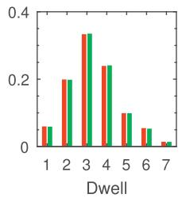

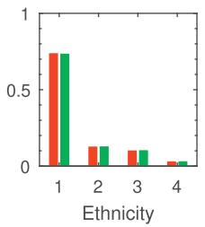

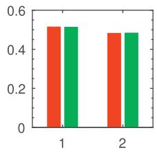

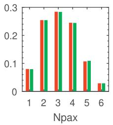

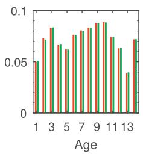

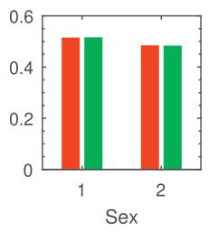

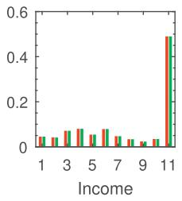

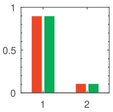

Fig. 1. Marginal distributions obtained from the PUMS and synthetic population for household-level attributes (first row) and individual-level attributes (second row).  
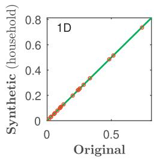

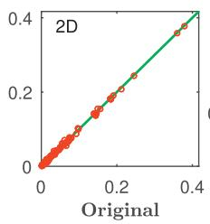

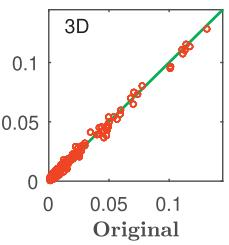

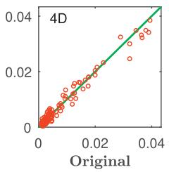

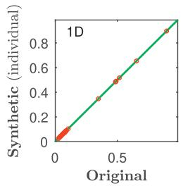

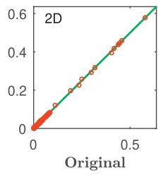

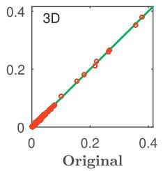

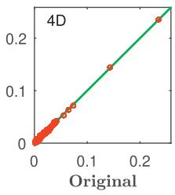

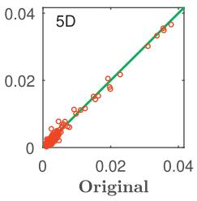  
Fig. 2. Marginal distributions aggregated for different number of dimensions for household-level attributes (first row) and individual-level attributes (second row).

(Dunson and Xing, 2012):

$$
\rho _ { k l } = \sqrt { \frac { 1 } { \operatorname* { m i n } \left\{ d _ { k } , d _ { l } \right\} - 1 } \sum _ { c _ { k } = 1 } ^ { d _ { k } } \sum _ { c _ { l } = 1 } ^ { d _ { l } } \frac { \left( \varphi _ { c _ { k } c _ { l } } - \bar { \varphi } _ { c _ { k } } ^ { ( k ) } \bar { \varphi } _ { c _ { l } } ^ { ( l ) } \right) ^ { 2 } } { \bar { \varphi } _ { c _ { k } } ^ { ( k ) } \bar { \varphi } _ { c _ { l } } ^ { ( l ) } } } ,\tag{15}
$$

where $\varphi _ { x ^ { k } x ^ { l } }$ is the bivariate distribution on $x ^ { k }$ and $x ^ { l }$ and $\bar { \varphi } _ { x ^ { k } } ^ { ( k ) }$ is the marginal distribution of variable $x ^ { k } .$ Cramer’s V is often used to measure the joint association between two categorical nominal variables. The value of $\rho _ { k l }$ ranges from 0 to 1, with $\rho _ { k l } = 0$ when the two variables are independent. A high value of $\rho _ { k l }$ indicates strong dependency between variables $x ^ { k }$ and $x ^ { l } .$

Based on the PUMS, we create a new table by flattening household-level attributes (i.e., assigning household-level attributes to each individual and thus removing the hierarchical structure). Fig. 3(a) shows the empirical pairwise Cramer’s V among both household-level attributes (dwelling type, ethnicity, car availability, and total number of members) and individuallevel attributes (age, sex, income, driving license, and pass type). The upper-left square $( 4 \times 4 )$ shows the degree of association among household-level attributes. The two strongest association values come from Dwell & Car (with $\rho = 0 . 3 6 6 )$ and Car & Npax (with $\rho = 0 . 2 0 5 )$ . The lower-right square $( 5 \times 5 )$ shows pairwise association among individual-level attributes. We found that individual-level attributes in general demonstrate stronger association than household-level attributes. There are

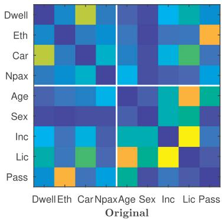

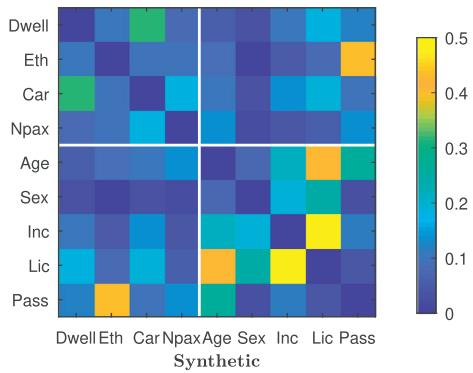  
Fig. 3. Joint association of both household-level and individual-level attributes.

6 pairs having $\rho > 0 . 2 0 0 ,$ including Income & License (with $\rho = 0 . 4 9 4 )$ , Age & License (with $\rho = 0 . 4 1 1 )$ , Sex & License (with $\rho = 0 . 2 8 1 )$ , Age & Pass type (with $\rho = 0 . 2 7 2 )$ , Sex & Income (with $\rho = 0 . 2 3 4 )$ , and Age & Income (with $\rho = 0 . 2 2 8 )$ . In addition to the within-level association, the upper-right (or the lower-left) matrix shows the cross-level association. In this case, we observe strong association values for Ethnicity & Pass type (with $\rho = 0 . 4 1 3 )$ , Car & License (with $\rho = 0 . 3 2 2 )$ , and Dwell & License (with $\rho = 0 . 2 3 7 )$ .

As a comparison, Fig. 3(b) shows the same association matrix computed using the synthetic population (averaged over 10 sets of populations). We find that the synthetic population generated by the hierarchical mixture model gives a very similar $\rho$ matrix to the empirical one computed using the PUMS. This indicates that the conditional distribution $\mu _ { g m }$ can capture very well the diversity of individual distributions across households. Overall, the above analysis shows that the proposed framework generalizes the underlying structure efficiently and accurately, not only capturing the association within each level, but also preserving the cross-level association.

## 4.4. Individual association within households

In general, we see that the household/individual attribute associations are well-modeled by the product multinomial hierarchical mixture model in Eq. (3). However, considering that all individuals are conditionally independent given zi:

$$
p \big ( \mathbf { x } _ { i 1 } , \ldots , \mathbf { x } _ { i n _ { i } } | z _ { i } \big ) = \prod _ { j = 1 } ^ { n _ { i } } p \big ( \mathbf { x } _ { i j } | z _ { i } \big ) ,\tag{16}
$$

the inter-person relationships/associations within a household is essentially ignored.

This assumption makes the inference easy to perform, and to certain extent it still can capture some inter-person relation provided through the interaction term $\mu _ { g m }$ . However, in real population data this assumption is often violated, as a person in a household plays a unique role (e.g., husband, wife, and child) and there exist strong structural relationships among different individuals. For example, most two-person households in the PUMS are couples (household head and spouse), and the empirical probability of one being male and the other being female is $p \big ( x _ { i 1 } ^ { 6 } \neq x _ { i 2 } ^ { 6 } \big ) = p \big ( x _ { i 1 } ^ { 6 } = 1 , x _ { i 2 } ^ { 6 } = 2 \big ) + p \big ( x _ { i 1 } ^ { 6 } = 2 , x _ { i 2 } ^ { 6 } = 1 \big ) =$ 0.86. However, in the synthetic cases where household members are sampled independently given $z _ { i } ,$ we have $p \big ( x _ { i 1 } ^ { 6 } \neq x _ { i 2 } ^ { 6 } \big ) =$ 0.50. Therefore, this type of joint association/relationship is missed by sampling individuals independently using Eq. (2).

To further demonstrate this effect, we create a subset by selecting two-person households from the PUMS and quantify-Cramer’sV of the two persons’ attributes. We refer to the two persons in a household as A and B. As a comparison, we also create a subset of two-person household from the synthetic population. The first two panels in Fig. 4 show the values of ρ among attributes of person A and B in the original PUMS and the synthetic population, respectively. The third panel shows their absolute difference $| \rho _ { 1 } - \rho _ { 2 } |$ . As we can see, there is no much difference in terms of each individual. However, in the matrix of joint association between A and B, we observed clear difference for age- and sex-related combinations and the most obvious difference is observed on $\rho _ { \mathsf { s e x } _ { A } , \mathsf { s e x } _ { B } } .$ . In fact, the sex attributes of A and B are highly dependent in the PUMS with $\rho = 0 . 7 2$ , while in the synthetic population they are almost independent with $\rho = 0 . 0 1$ . This suggests that in the synthetic data we have generated more same-sex two-person households than expected due to the conditional independence assumption in Eq. (16).

In order to correct this bias and capture these inter-person relationships, we propose to apply rejection sampling as a postprocessing step on the synthetic population. To illustrate this step, we use these two-person households as an example. Since most differences in Fig. 4 come from $a g e \mathrm { - }$ and sex-related combinations, we use these two attributes to build the acceptance-rejection rule. In doing so, we first propose a new distribution $f ( y _ { i 1 } , y _ { i 2 } )$ , where $y _ { i 1 }$ is the absolute age difference $( y _ { i 1 } = \left| x _ { i A } ^ { 5 } - x _ { i B } ^ { 5 } \right| )$ and $y _ { i 2 }$ is the absolute sex difference $( y _ { i 2 } = \left| x _ { i A } ^ { 6 } - x _ { i B } ^ { 6 } \right| ) ,$ considering the exchangeability of A and B. And next we compute the joint distribution of $y _ { 1 }$ and $y _ { 2 }$ from the synthetic population generated without individual association and consider it the proposal distribution $f _ { 1 } ( y _ { 1 } , y _ { 2 } )$ . The target distribution $f _ { 2 } ( y _ { 2 } , y _ { 2 } )$ is obtained by summarizing $y _ { 1 }$ and $y _ { 2 }$ in the PUMS data into a contingency table. We define $M = \operatorname* { m a x } _ { y _ { i 1 } , y _ { i 2 } } \frac { f _ { 2 } ( y _ { 1 } , y _ { 2 } ) } { f _ { 1 } ( y _ { 1 } , y _ { 2 } ) }$ . In the case study, we have $M = 2 . 9 7$ . In performing the rejection sampling, we accept a household i with probability $\begin{array} { r } { \alpha _ { i } = \frac { f _ { 2 } ( y _ { i 1 } , y _ { i 2 } ) } { M \times f _ { 1 } ( y _ { i 1 } , y _ { i 2 } ) } } \end{array}$

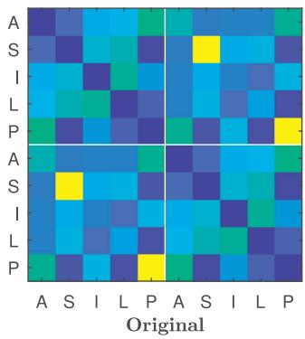

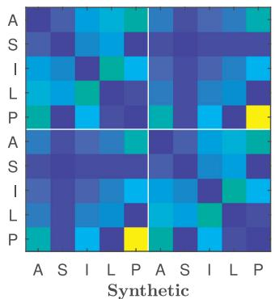

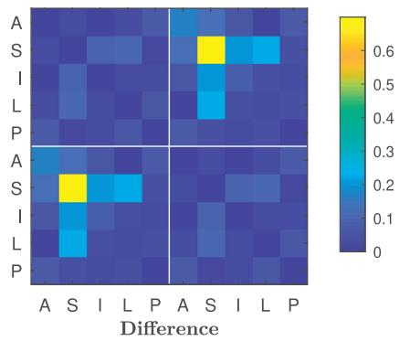  
Fig. 4. Joint association of individual-level attributes between two people in the same household. (A: age, S: sex, I: income, L: license, and P: pass type).

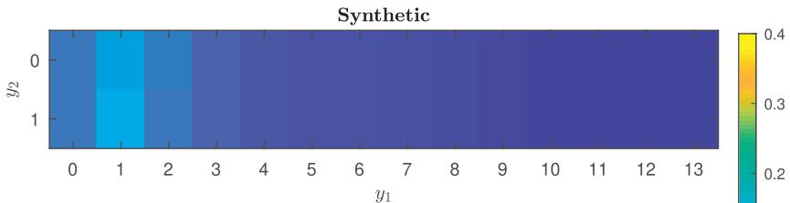

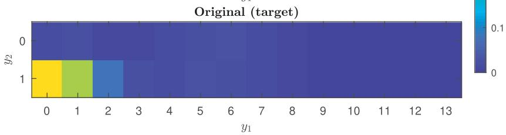  
Fig. 5. Proposal distribution $f _ { 1 } ( y _ { 1 } , y _ { 2 } )$ and target distribution $f _ { 2 } ( y _ { 1 } , y _ { 2 } ) .$

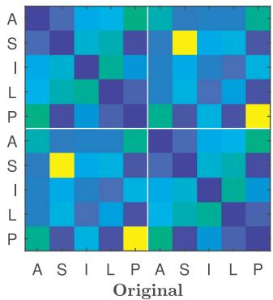

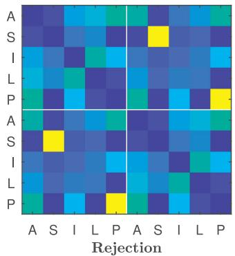

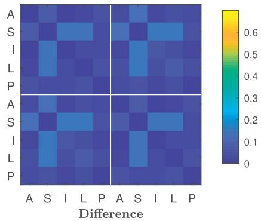  
Fig. 6. Joint association of two individuals in the same household after postprocessing by rejection sampling. (A: age, S: sex, I: income, L: license, and P: pass type).

The first panel in Fig. 5 shows the proposal distribution $f _ { 1 } ( y _ { 1 } , y _ { 2 } )$ obtained from the synthetic population without considering those A-B associations. And the second panel shows the target distribution $f _ { 1 } ( y _ { 1 } , y _ { 2 } )$ obtained from the PUMS. After performing the rejection sampling algorithm, we obtain a new set of two-person households. Fig. 6 shows the comparison for two-person households between the PUMS and the corrected synthetic population. As can be seen, the cross individual association is well captured by introducing the rejection sampling scheme and the difference becomes negligible. We consider this new set the final synthetic population for two-person households. The same procedure can be applied for other household types (e.g., three-person). A critical problem here is how to define the format f of the proposal/target distributions used in rejection sampling. In the two-person example, we simplify the comparison of complex distribution p(x) into the comparison of a simple bivariate distribution $f ( y _ { 1 } , y _ { 2 } )$ , making the acceptance-rejection scheme easy to implement and maintain a high acceptance rate. For other applications, we also suggest to use age- and sex-related transformation and to limit the number of transformed variables to avoid the curse of dimensionality in conducting rejection sampling.

After this step, we obtain a pool of synthetic households, which matches the underlying structural distribution of the PUMS. Still, the marginal distributions are not integrated yet. In producing a target population with known marginal distributions (e.g., population for a particular region), Casati et al. (2015) applied generalized raking as a postprocessing step on the synthetic population pool generated from MCMC to reweight household and create a target population that matches those marginals (Deville et al., 1993). Here, we may take the pool as a seed and apply generalized raking to create population matching those known marginals. This can be also done by just take the known marginals as a target distribution and apply rejection sampling as another filtering step. The final synthetic population will match not only the statistical properties, but also the known marginals.

## 5. Conclusion and discussion

In this paper, we bring the product multinomial hierarchical mixture framework to the context of synthetic population with a two-level structure (household-individual) coded in categorical attributes. This is the most common structure for census and household-based surveys. In this setting, our focus is to create a probabilistic model to capture and generalize the joint distribution for all variables at both levels in the structure.

We create such a model by integrating three different component models. The first is probabilistic CP factorization. The function of this model is to capture a multivariate distribution of nominal categorical variables as a mixture of product multinomials. The second model is the multilevel latent class model. The objective of this model is to add a layer to connect household classes and individual classes by using a conditional distribution. In particular, we propose to use universal classes at the individual level for model generalization and avoiding overfitting, and use the conditional distribution of individual class on household class to capture the interaction/association between the two levels. This model can be efficiently estimated using an EM algorithm, and synthetic households can be generated by drawing samples for the estimated model.

We apply this model on Singapore’s national travel survey data—HITS, which includes 4 household-level attributes and 5 individual-level attributes. This case study demonstrates great potential of the proposed model in reproducing both withinand cross-level associations among all variables. However, given the conditional independence assumption of household members on household latent classes, the structural relationships among household members are not well captured. To amend this, we apply rejection sampling as the third component in the framework to reproduce structural relationships and identify the role of each member in a synthetic household. With this process, one can generate a large pool of population that reproduces statistical properties of the given PUMS. The pool of population (e.g., 1 million synthetic household) could serve as a base to resample a new population matching those known marginals. For example, if interested in creating synthetic population for a particular region with some marginal controls at the household-/individual-level, one can apply another step of generalized raking (Deville et al., 1993; Casati et al., 2015) or impose another rejection sampling procedure that takes the known marginals as target distributions. We refer interested readers to Casati et al. (2015) for an example of population synthesis that uses generalized raking to reweight samples in order to match marginal controls.

This paper enriches existing literature on population synthesis problem, in particular about modeling the hierarchical household-individual structure. While in most previous practices one need to develop model-specific strategies to account for household-individual associations (Pritchard and Miller, 2012; Anderson et al., 2014), our model provides a natural solution for this problem. In this sense, the application of this framework is beyond population synthesis, since this type of hierarchical data structure is common in social science research and survey analysis. There are several directions for future research. The first is to remove the restriction on categorical nominal variables, which may help the modeling of continuous attributes such as age and income. In this case, we may use some parametric distributions for continuous variables (e.g., Beta and Gaussian) to capture latent classes using only a few parameters. The second direction is to deal with missing data. This is particularly important if the input PUMS comes from surveys with missing or partial observations. For this purpose, we can further add an imputation step within the modeling framework. The third direction is to better integrate the association of household members into the modeling framework. While the current framework applies rejection sampling as postprocessing step to model the interdependency among household members, a potential direction is to integrate member association in the core model using other statistical approaches.

## Acknowledgement

This work is supported by the National Natural Science Foundation of China (No. 11574407) and the Scienceand Technology Planning Project of Guangzhou City, China (No. 201704020142).

## References

Anderson, P., Farooq, B., Efthymiou, D., Bierlaire, M., 2014. Associations generation in synthetic population for transportation applications: graph-theoretic solution. Transp. Res. Record 2429, 38–50.

Balmer, M., Axhausen, K.W., Nagel, K., 2006. Agent-based demand-modeling framework for large-scale microsimulations. Transp. Res. Record 1985 (1), 125–134.

Barthelemy, J., Toint, P.L., 2013. Synthetic population generation without a sample. Transp. Sci. 47 (2), 266–279.

Beckman, R.J., Baggerly, K.A., McKay, M.D., 1996. Creating synthetic baseline populations. Transp. Res. Part A 30 (6), 415–429.

Caiola, G., Reiter, J.P., 2010. Random forests for generating partially synthetic, categorical data. Trans. Data Privacy 3 (1), 27–42.

Casati, D., Müller, K., Fourie, P.J., Erath, A., Axhausen, K.W., 2015. Synthetic population generation by combining a hierarchical, simulation-based approach with reweighting by generalized raking. Transp. Res. Record 2493, 107–116.

Deming, W. E., Stephan, F. F., 1940. On a least squares adjustment of a sampled frequency table when the expected marginal totals are known 11 (4), 427–444.

Dempster, A.P., Laird, N.M., Rubin, D.B., 1977. Maximum likelihood from incomplete data via the em algorithm. J. R. Stat. Soc. Ser. B (methodological) 1–38.

Deville, J.C., Särndal, C.E., Sautory, O., 1993. Generalized raking procedures in survey sampling. J. Am. Stat. Assoc. 88 (423), 1013–1020.

Dunson, D.B., Xing, C., 2012. Nonparametric bayes modeling of multivariate categorical data. J. Am. Stat. Assoc. 104 (487), 1042–1051.

Farooq, B., Bierlaire, M., Hurtubia, R., Flötteröd, G., 2013. Simulation based population synthesis. Transp. Res. Part B 58, 243–263.

Guo, J.Y., Bhat, C.R., 2007. Population synthesis for microsimulating travel behavior. Transp. Res. Rec. 2014, 92–101.

Hu, J., Reiter, J.P., Wang, Q., et al., 2017. Dirichlet process mixture models for modeling and generating synthetic versions of nested categorical data. Bayesian Anal. 13 (1), 183–200.

Müller, K., Axhausen, K.W., 2011. Population synthesis for microsimulation: State of the art. Transportation Research Board 90th Annual Meeting. Washington, D.C.

Pritchard, D.R., Miller, E.J., 2012. Advances in population synthesis: fitting many attributes per agent and fitting to household and person margins simultaneously. Transportation 39 (3), 685–704.

Reiter, J.P., 2005. Using CART to generate partially synthetic public use microdata. J. Offical Stat. 21 (3), 441.

Saadi, I., Mustafa, A., Teller, J., Farooq, B., Cools, M., 2016. Hidden markov model-based population synthesis. Transp. Res. Part B 90, 1–21.

Sun, L., Axhausen, K.W., 2016. Understanding urban mobility patterns with a probabilistic tensor factorization framework. Transp. Res. Part B 91, 511–524.

Sun, L., Erath, A., 2015. A bayesian network approach for population synthesis. 4th Symposium of the European Association for Research in Transportation. Copenhagen, Denmark.

Vermunt, J.K., 2003. Multilevel latent class models. Sociol. Methodol. 33 (1), 213–239.

Vermunt, J.K., 2008. Latent class and finite mixture models for multilevel data sets. Stat. Methods Med. Res. 17 (1), 33–51.

Voas, D., Williamson, P., 2001. Evaluating goodness-of-fit measures for synthetic microdata. Geogr. Environ. Modell. 5 (2), 177–200.

Williamson, P., Birkin, M., Rees, P.H., 1998. The estimation of population microdata by using data from small area statistics and samples of anonymised records. Environ. Plann. A 30 (5), 785–816.

Ye, X., Konduri, K., Pendyala, R.M., Sana, B., Waddell, P., 2009. Methodology to match distributions of both household and person attributes in the generation of synthetic populations. Transportation Research Board 88th Annual Meeting. Washington, D.C.

Zhu, Y., Ferreira, J., 2014. Synthetic population generation at disaggregated spatial scales for land use and transportation microsimulation. Transp. Res. Rec. 2429, 168–177.